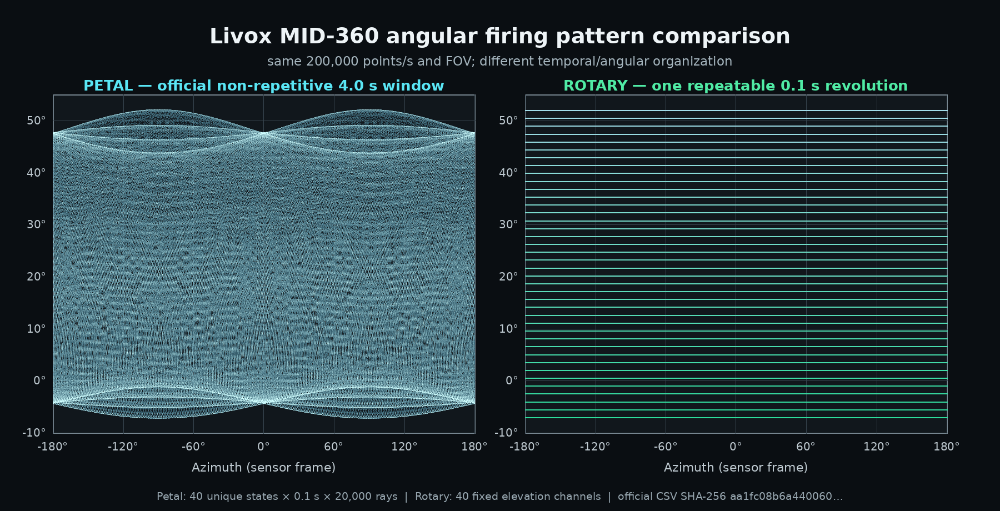
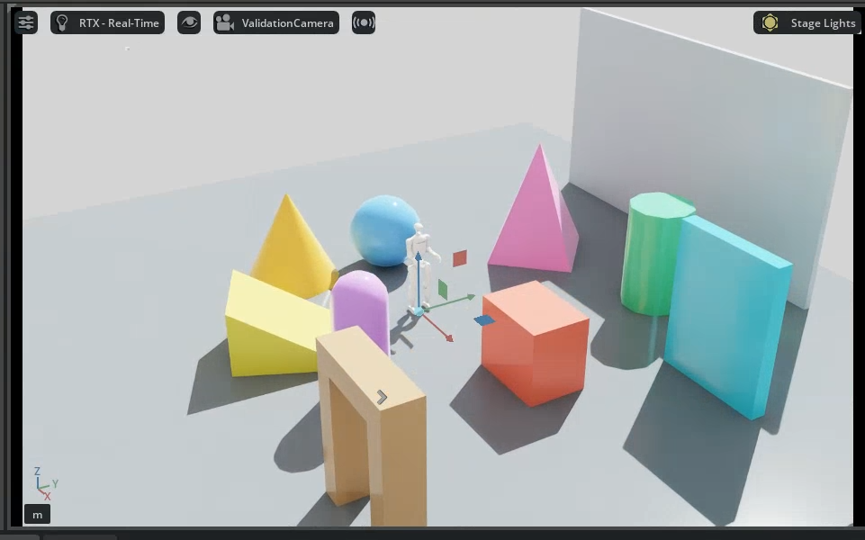
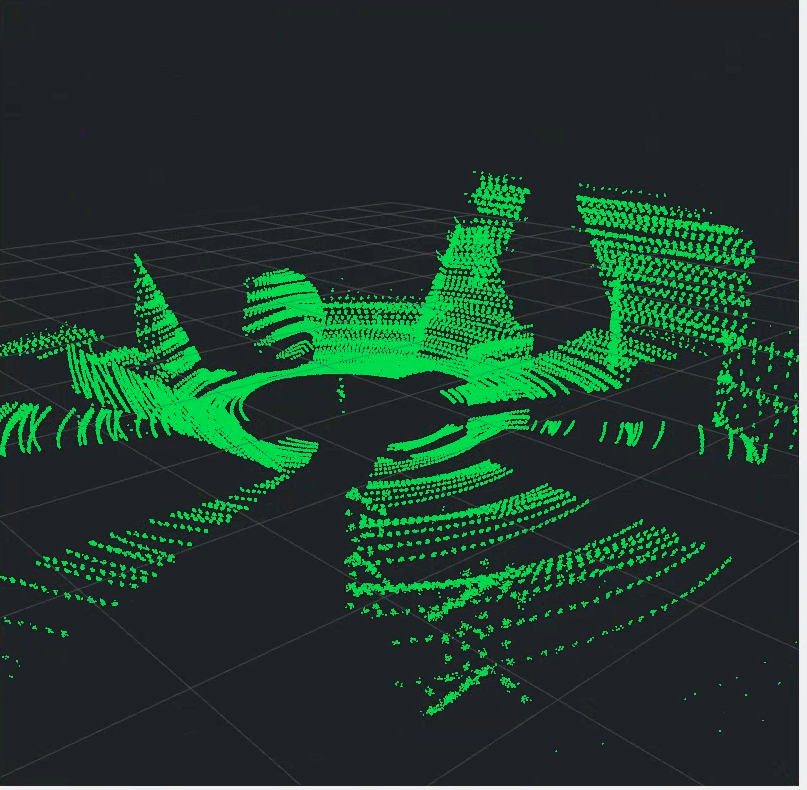
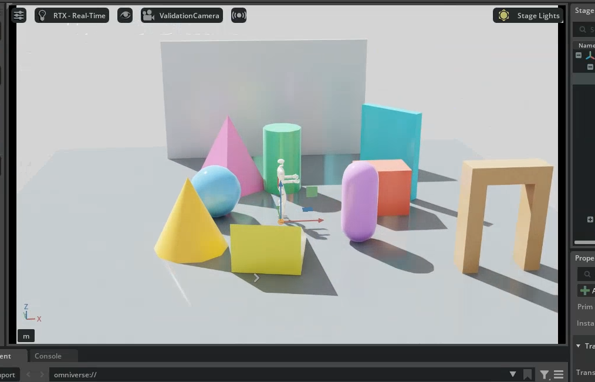
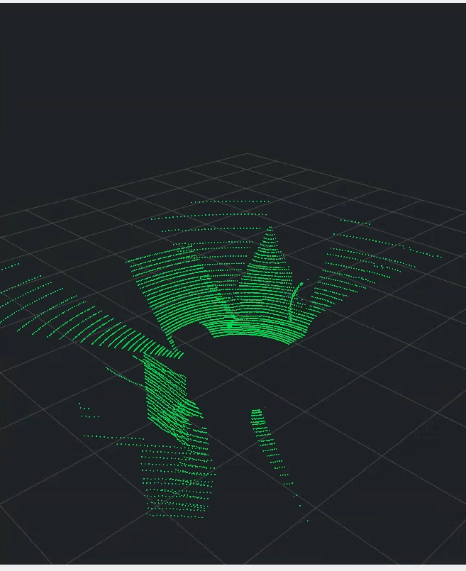
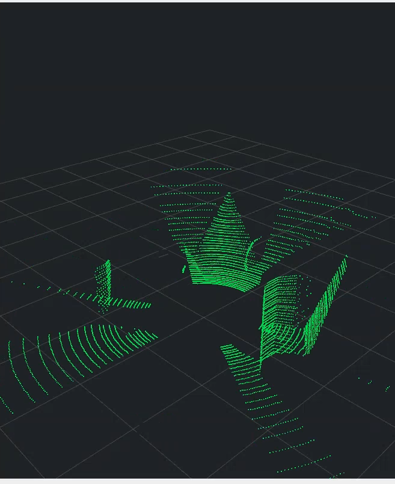

# Livox MID-360 for Isaac Sim 5.1

**English** | [简体中文](README_CN.md)

Canonical project name: **Livox_MID360_IsaacSim**.

This repository provides two explicitly separated MID-360 simulation scan profiles. Each profile
includes a standalone LiDAR, a LiDAR-equipped Unitree G1 4010, and clearly distinguished
LiDAR-equipped Unitree G1 5010 Mode13 and Mode15 robots, for a total of eight publishable assets.

## Asset matrix

| Scan profile | Standalone MID-360 | G1 4010 | G1 5010 Mode13 | G1 5010 Mode15 |
| --- | --- | --- | --- | --- |
| Petal Scan | `assets/petal_scan/standalone/Livox_MID360_Petal_Scan.usd` | `assets/petal_scan/g1_4010/Unitree_G1_4010_MID360_Petal_Scan.usd` | `assets/petal_scan/g1_5010_mode_13/Unitree_G1_5010_Mode13_MID360_Petal_Scan.usd` | `assets/petal_scan/g1_5010_mode_15/Unitree_G1_5010_Mode15_MID360_Petal_Scan.usd` |
| Rotary Scan (conventional rotary approximation) | `assets/rotary_scan/standalone/Livox_MID360_Rotary_Scan.usd` | `assets/rotary_scan/g1_4010/Unitree_G1_4010_MID360_Rotary_Scan.usd` | `assets/rotary_scan/g1_5010_mode_13/Unitree_G1_5010_Mode13_MID360_Rotary_Scan.usd` | `assets/rotary_scan/g1_5010_mode_15/Unitree_G1_5010_Mode15_MID360_Rotary_Scan.usd` |

Mode13 and Mode15 are not aliases. They are derived from the official
`g1_29dof_mode_13.urdf` and `g1_29dof_mode_15.urdf`, respectively. Mode13 uses a
14.3/22.5 hip reduction ratio, while Mode15 uses 22.5/22.5. Both use 5010 wrist motors
and have an unlocked waist.

Shared resources are under `assets/common/`:

- `Livox_MID360_CAD.usd`: CAD geometry converted from the user-provided STEP assembly;
- `mid360_official_pattern/mid360.csv`: the official Livox four-second reference trajectory;
- `g1_5010_support/`: 5010 robot provenance, meshes, and training-collision URDFs.

## Petal Scan

Petal Scan uses the 800,000 ordered directions from the official Livox
`livox_laser_simulation` project to produce non-repetitive petal coverage over a four-second
reference window:

| Parameter | Value |
| --- | --- |
| `scanType` | `SOLID_STATE` |
| Output point rate | 200,000 points/s |
| Scan frame rate | 10 Hz |
| Trajectory states | 40 × 0.1 s |
| Rays per state | 20,000 |
| Per-point timing | 5 μs |
| Reference window | 4 s, then repeats |
| Nominal vertical FOV | -7° to +52° |

Isaac Sim 5.1 limits the size of individual sensor attributes, so the USD OmniLidar keeps one
20,000-ray RTX state. At runtime, the driver replaces it with another equally sized array every
0.1 seconds. The complete compressed trajectory is stored in the
`mid360_nonrepetitive_pattern` Scope beside the LiDAR.

## Rotary Scan

Rotary Scan retains the project's deterministic 40-line rotary approximation. It is intended for
debugging, performance baselines, and use cases that do not require the physical sensor's scan pattern:

| Parameter | Value |
| --- | --- |
| `scanType` | `ROTARY` |
| Emitters | 40 |
| Report rate per line | 5,000 Hz |
| Scan frequency | 10 Hz |
| Target point rate | 40 × 5,000 = 200,000 points/s |
| Vertical coverage | -7° to +52° |

Rotary Scan has no petal-trajectory Scope and does not start the runtime state driver.

## Robot mounting contract

The LiDAR mount is identical on the 4010 and 5010 robots:

- translation from `torso_link`: `[0.0002835, 0.00003, 0.41618]` m;
- roll: 180° inverted installation;
- the LiDAR and `mid360_imu` are colocated and aligned;
- IMU type: `IsaacImuSensor`, period `0.005 s` (200 Hz);
- ROS point-cloud frame: `mid360_link`;
- ROS IMU topic: `/mid360/imu`, frame: `mid360_link`;
- TF: robot root to `mid360_link`;
- LiDAR/IMU relative extrinsics: `T=[0,0,0]`, `R=I`.

All G1 USD files are flattened, single-file robot assets. They do not embed a locomotion policy,
mapping stack, or control Action Graph.

## Using the assets in Isaac Sim 5.1

1. Open or reference any USD from the asset matrix.
2. Enable `isaacsim.ros2.bridge` and set
   `/app/sensors/nv/lidar/outputBufferOnGPU=true`.
3. Run `scripts/publish_mid360_ros2_isaacsim51.py` in the Script Editor.
4. Petal Scan starts the 40-state driver automatically; Rotary Scan uses its fixed rotary
   configuration directly from the USD.
5. Call `cleanup_mid360_ros2()` to remove the runtime graph.

To publish IMU data, connect the `mid360_imu` Prim listed in each asset README to
`IsaacReadIMU` and `ROS2PublishImu`. The `README.md` in each of the eight asset directories
documents its Prim paths, ROS 2 topics, and sensor extrinsics.

The standalone assets reference `assets/common/Livox_MID360_CAD.usd` relatively. Preserve the
repository directory structure when cloning or copying them.

## Portable test scenes

### Self-built object field with a fixed G1 5010 Mode13

This validation uses only the self-built scene in this repository. Both robot feet touch the
ground; a World FixedJoint anchors the robot, and all 29 revolute-joint limits are locked to zero.
Nine different object types and a ground-contacting 5.5 m × 3.2 m projection wall are placed within
5 m. No policy, locomotion controller, or mapping component is loaded:

```bash
./scripts/run_object_field_validation.sh petal
./scripts/run_rviz2_mid360.sh petal

# Or use the conventional rotary approximation
./scripts/run_object_field_validation.sh rotary
./scripts/run_rviz2_mid360.sh rotary
```

RViz2 uses the upright robot frame `G1`. The Petal profile accumulates 4.2 seconds to include the
complete 40-state reference window, while the Rotary profile retains only one 0.1-second
revolution. The topic remains `/mid360/points`, and the publisher does not downsample the data.
See `tests/scenes/object_field/README.md` for details.

### Azimuth–elevation trajectory comparison

The figure below is generated from the repository-pinned set of 800,000 official Petal directions.
The Rotary panel uses the asset's 40 fixed elevation channels. This compares ray directions and is
independent of scene-surface geometry:



Reproduce the figure with:

```bash
python3 scripts/generate_scan_pattern_comparison.py
```

### Controlled comparison screenshots (Isaac Sim 5.1, 2026-08-09)

Both groups use the same self-built scene layout, fixed-joint G1 5010 Mode13 robot, LiDAR pose,
and `/mid360/points` publishing path. Only the scan profile and RViz2 display accumulation differ.

#### Petal: complete 4.2-second petal cycle





The 4.2-second accumulation covers all 40 consecutive direction states. It produces dense,
interleaved, elevation-varying, non-repetitive tracks on the wall and curved surfaces.

#### Rotary: one regular 0.1-second revolution





The 0.1-second display shows only one 40-line rotary revolution. The cloud is therefore visibly
sparser and forms regular, parallel horizontal scan bands. A second frame confirms that this
structure repeats with rotation rather than being a single-frame coincidence:



#### Historical 0.5-second integration baseline

Earlier 0.5-second Petal and Rotary screenshots of the same scene remain in
[`docs/validation/screenshots/`](docs/validation/screenshots/). They document ROS 2/RViz2
integration and are not used as the controlled scan-pattern comparison.

`tests/scenes/` also provides directly openable 6, 10, and 15 cm stair stages. Each stage references
the standalone Petal Scan by default and includes lighting and a PhysicsScene. The underlying stair
USDs are fully self-contained and do not depend on Lidar_Hiking:

```text
tests/scenes/MID360_Test_H06cm.usda
tests/scenes/MID360_Test_H10cm.usda
tests/scenes/MID360_Test_H15cm.usda
```

See `tests/scenes/README.md` for switching to Rotary Scan or G1 4010/5010 assets and selecting the
point-cloud topic in RViz2.

## Rebuilding and validation

Reapply the Petal Scan robot profiles:

```bash
/path/to/isaac-sim/python.sh scripts/apply_mid360_petal_profile.py
```

Rebuild the standalone assets:

```bash
/path/to/isaac-sim/python.sh scripts/build_mid360_standalone_assets.py \
  assets/common/Livox_MID360_CAD.usd \
  assets/petal_scan/standalone/Livox_MID360_Petal_Scan.usd \
  --sensor-source assets/petal_scan/g1_4010/Unitree_G1_4010_MID360_Petal_Scan.usd

/path/to/isaac-sim/python.sh scripts/build_mid360_standalone_assets.py \
  assets/common/Livox_MID360_CAD.usd \
  assets/rotary_scan/standalone/Livox_MID360_Rotary_Scan.usd \
  --sensor-source assets/rotary_scan/g1_4010/Unitree_G1_4010_MID360_Rotary_Scan.usd
```

Add or refresh the IMU in all eight assets after rebuilding:

```bash
/path/to/isaac-sim/python.sh scripts/add_mid360_imu_isaacsim51.py
```

Synchronize the manifests and run the tests:

```bash
python3 scripts/update_asset_metadata.py
make check
```

## Limitations

- Petal Scan is non-repetitive within the official four-second reference window and repeats after
  four seconds. It is not an infinite-duration optical model of the physical sensor.
- Rotary Scan is a repeatable 40-line approximation and must not be used to assess real MID-360
  petal-coverage error.
- `fullScan=true` is unstable in the validated Isaac Sim 5.1.0-rc.19 build. The ROS publisher keeps
  `fullScan=false`; aggregate 0.1-second slices downstream when a complete 10 Hz scan is required.
- This repository provides only sensor and sensor-equipped robot assets. It does not include a
  Lidar_Hiking policy or FAST-LIO project.

## Sources and licensing

Original scripts are licensed under the root MIT License. Provenance and retained licenses for the
Livox trajectory, Unitree G1, InstinctLab-derived resources, and CAD are documented in
`THIRD_PARTY_NOTICES.md` and under `assets/common/`.
