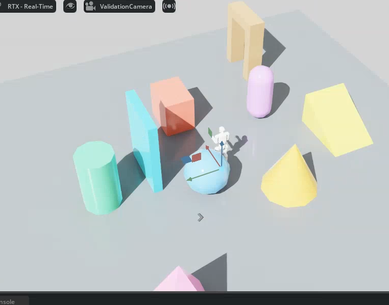
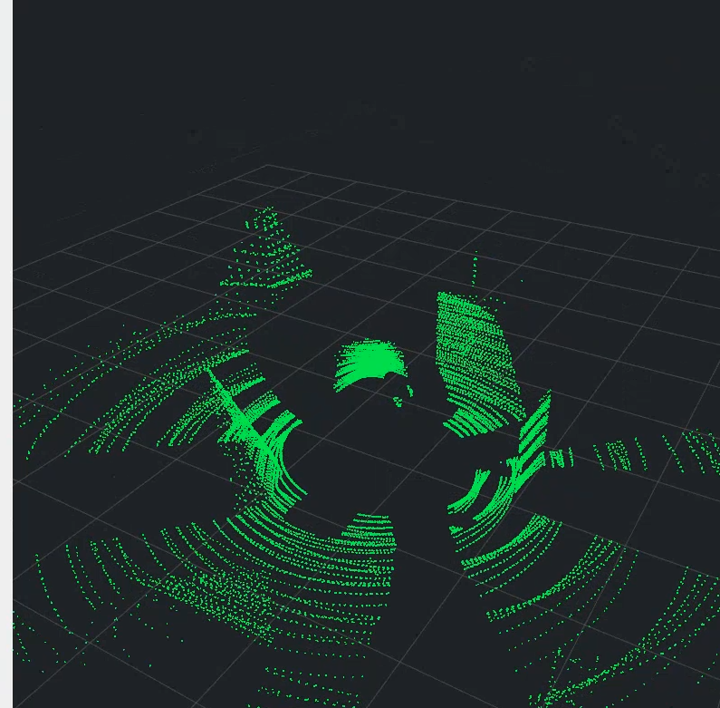
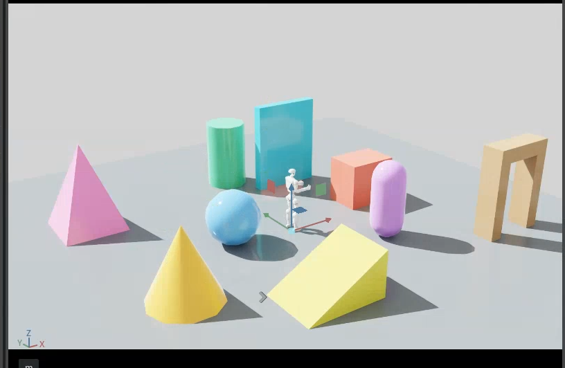
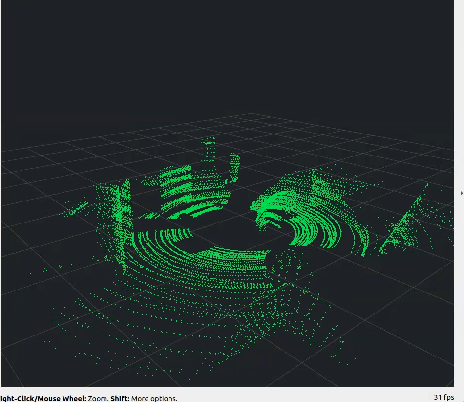
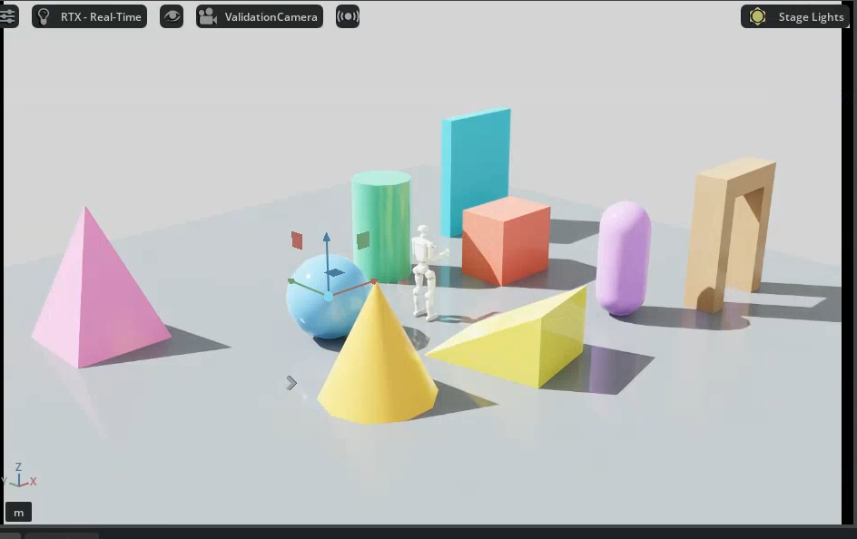
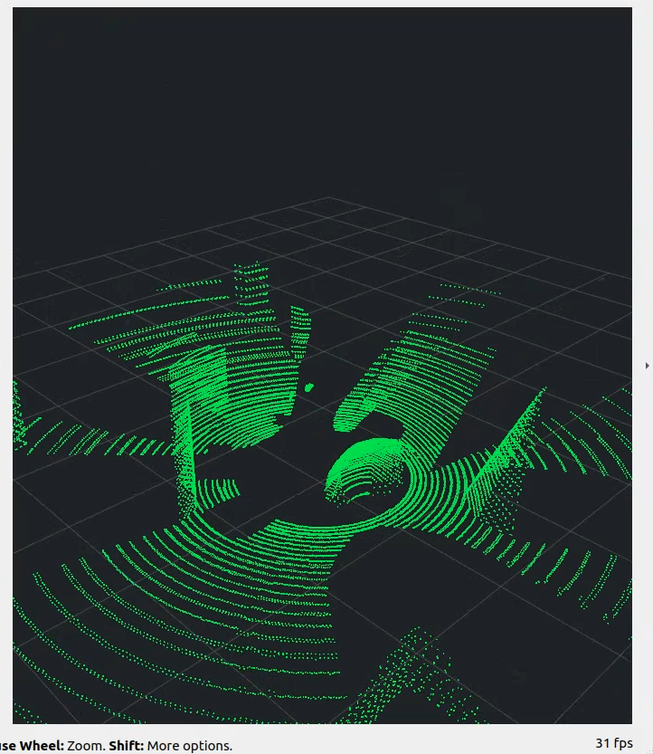

# Livox MID-360 for Isaac Sim 5.1

项目规范名：**Livox_MID360_IsaacSim**。

本仓库提供两套明确分离的 MID-360 仿真扫描配置，每套都包含独立雷达、
Unitree G1 4010 含雷达机器人，以及明确区分的 Unitree G1 5010 Mode13/Mode15
含雷达机器人，共八份可发布资产。

## 资产矩阵

| 扫描配置 | 独立 MID-360 | G1 4010 | G1 5010 Mode13 | G1 5010 Mode15 |
| --- | --- | --- | --- | --- |
| Petal Scan（花瓣扫描） | `assets/petal_scan/standalone/Livox_MID360_Petal_Scan.usd` | `assets/petal_scan/g1_4010/Unitree_G1_4010_MID360_Petal_Scan.usd` | `assets/petal_scan/g1_5010_mode_13/Unitree_G1_5010_Mode13_MID360_Petal_Scan.usd` | `assets/petal_scan/g1_5010_mode_15/Unitree_G1_5010_Mode15_MID360_Petal_Scan.usd` |
| Rotary Scan（普通旋转近似） | `assets/rotary_scan/standalone/Livox_MID360_Rotary_Scan.usd` | `assets/rotary_scan/g1_4010/Unitree_G1_4010_MID360_Rotary_Scan.usd` | `assets/rotary_scan/g1_5010_mode_13/Unitree_G1_5010_Mode13_MID360_Rotary_Scan.usd` | `assets/rotary_scan/g1_5010_mode_15/Unitree_G1_5010_Mode15_MID360_Rotary_Scan.usd` |

Mode13 与 Mode15 不是别名：两者分别来自官方 `g1_29dof_mode_13.urdf` 和
`g1_29dof_mode_15.urdf`。Mode13 髋部减速比为 14.3/22.5，Mode15 为
22.5/22.5；两者均为 5010 手腕且腰部未锁定。

共用资源位于 `assets/common/`：

- `Livox_MID360_CAD.usd`：由用户提供的 STEP 装配转换得到的 CAD 几何；
- `mid360_official_pattern/mid360.csv`：Livox 官方四秒参考轨迹；
- `g1_5010_support/`：5010 机器人来源、网格和训练碰撞 URDF。

## Petal Scan（花瓣扫描）

Petal Scan 使用 Livox 官方 `livox_laser_simulation` 的 800,000 条有序方向，
在四秒参考窗口内形成非重复花瓣覆盖：

| 参数 | 值 |
| --- | --- |
| `scanType` | `SOLID_STATE` |
| 输出点率 | 200,000 points/s |
| 扫描帧率 | 10 Hz |
| 轨迹状态 | 40 × 0.1 s |
| 每状态射线 | 20,000 |
| 单点时序 | 5 μs |
| 参考窗口 | 4 s；之后循环 |
| 标称垂直 FOV | -7° 到 +52° |

Isaac Sim 5.1 对单传感器属性有大小限制，因此 USD 内的 OmniLidar 始终保留一个
20,000-ray RTX state，运行驱动器每 0.1 秒替换同长度数组。完整轨迹压缩保存在雷达旁的
`mid360_nonrepetitive_pattern` Scope 中。

## Rotary Scan（普通雷达）

Rotary Scan 保留原项目的确定性 40 线旋转近似，适用于调试、性能基线和不需要真机花纹的场景：

| 参数 | 值 |
| --- | --- |
| `scanType` | `ROTARY` |
| emitters | 40 |
| 每线 report rate | 5,000 Hz |
| 扫描频率 | 10 Hz |
| 目标点率 | 40 × 5,000 = 200,000 points/s |
| 垂直覆盖 | -7° 到 +52° |

Rotary Scan 不包含花瓣轨迹 Scope，也不启动运行时状态切换器。

## 机器人安装合同

4010 和 5010 的雷达安装保持一致：

- 相对 `torso_link` 平移：`[0.0002835, 0.00003, 0.41618]` m；
- 滚转：180° 倒装；
- LiDAR 和 `mid360_imu` 同位同向；
- IMU 类型：`IsaacImuSensor`，周期 `0.005 s`（200 Hz）；
- ROS 点云 frame：`mid360_link`；
- ROS IMU 话题：`/mid360/imu`，frame：`mid360_link`；
- TF：机器人根节点到 `mid360_link`；
- LiDAR/IMU 相对外参：`T=[0,0,0]`、`R=I`。

两份 G1 USD 都是展平的单文件机器人资产，不固化运动策略、建图或控制 Action Graph。

## Isaac Sim 5.1 使用

1. 直接打开或引用资产矩阵中的任意 USD。
2. 启用 `isaacsim.ros2.bridge`，并设置
   `/app/sensors/nv/lidar/outputBufferOnGPU=true`。
3. 在 Script Editor 运行 `scripts/publish_mid360_ros2_isaacsim51.py`。
4. Petal Scan 会自动启动 40 状态驱动；Rotary Scan 直接使用 USD 内的固定旋转配置。
5. 清理运行时图：调用 `cleanup_mid360_ros2()`。

读取 IMU 时，将各资产 README 中列出的 `mid360_imu` Prim 接入
`IsaacReadIMU` 和 `ROS2PublishImu`。八个资产各自目录中的 `README.md`
分别给出了 Prim 路径、ROS 2 话题和传感器外参设置。

独立资产会相对引用 `assets/common/Livox_MID360_CAD.usd`，克隆或复制时应保留仓库目录结构。

## 可移植测试场景

### 自建物体场 + 固定 G1 5010 Mode13

该验证只使用本仓库自建场景，机器人双脚落地且通过 World FixedJoint 固定，29 个旋转关节
上下限均锁为 0；5 m 内放置九类贴地物体。不加载策略、运控或建图组件：

```bash
./scripts/run_object_field_validation.sh petal
./scripts/run_rviz2_mid360.sh

# 或普通旋转近似
./scripts/run_object_field_validation.sh rotary
./scripts/run_rviz2_mid360.sh
```

RViz2 使用直立机器人坐标系 `G1`，并仅为显示密度累积 0.5 s 切片；话题仍为
`/mid360/points`，发布端不降采样。详见 `tests/scenes/object_field/README.md`。

### 实机联调截图（Isaac Sim 5.1，2026-08-09）

G1 5010 Mode13 固定关节、Petal Scan、自建九类物体场：



同一次运行由 Isaac Sim ROS 2 Bridge 发布 `/mid360/points`，RViz2 以直立 `G1`
坐标系显示，并累积 0.5 s RTX 切片：



另一观察角度的同配置运行总览（用于展示全部物体与较长显示积累效果）：





以上四张均为 Petal 配置。

同一机器人、同一物体场切换为 Rotary Scan（确定性 40 线重复扫描）：





Rotary 图中规则、重复的扫描线可作为对照；Petal 图来自 40 个连续变化的 0.1 s
官方方向状态。两组均使用相同的 0.5 s RViz 显示累积，不改变发布端数据。

`tests/scenes/` 提供可直接打开的 6、10、15 cm 阶梯 Stage。每个 Stage 默认引用 Petal Scan
独立雷达，带灯光和 PhysicsScene；底层阶梯 USD 完全自包含，不依赖 Lidar_Hiking：

```text
tests/scenes/MID360_Test_H06cm.usda
tests/scenes/MID360_Test_H10cm.usda
tests/scenes/MID360_Test_H15cm.usda
```

如何切换 Rotary Scan、G1 4010/5010，以及如何在 RViz2 中选择点云话题，见
`tests/scenes/README.md`。

## 重建与验证

重新写入 Petal Scan 机器人配置：

```bash
/path/to/isaac-sim/python.sh scripts/apply_mid360_petal_profile.py
```

重建独立资产：

```bash
/path/to/isaac-sim/python.sh scripts/build_mid360_standalone_assets.py \
  assets/common/Livox_MID360_CAD.usd \
  assets/petal_scan/standalone/Livox_MID360_Petal_Scan.usd \
  --sensor-source assets/petal_scan/g1_4010/Unitree_G1_4010_MID360_Petal_Scan.usd

/path/to/isaac-sim/python.sh scripts/build_mid360_standalone_assets.py \
  assets/common/Livox_MID360_CAD.usd \
  assets/rotary_scan/standalone/Livox_MID360_Rotary_Scan.usd \
  --sensor-source assets/rotary_scan/g1_4010/Unitree_G1_4010_MID360_Rotary_Scan.usd
```

重建后补入/刷新八个资产的 IMU：

```bash
/path/to/isaac-sim/python.sh scripts/add_mid360_imu_isaacsim51.py
```

同步清单并运行测试：

```bash
python3 scripts/update_asset_metadata.py
make check
```

## 限制

- Petal Scan 在官方四秒参考窗口内非重复，第 4 秒后循环，不等同于无限时长真机光学模型。
- Rotary Scan 是可重复的 40 线近似，不用于评估真实 MID-360 花瓣覆盖误差。
- `fullScan=true` 在验证使用的 Isaac Sim 5.1.0-rc.19 中不稳定，ROS 发布脚本保持
  `fullScan=false`，需要完整 10 Hz 扫描时应在下游聚合 0.1 秒切片。
- 仓库只提供传感器与机器人组合资产，不包含 Lidar_Hiking 策略或 FAST-LIO 工程。

## 来源与许可证

原创脚本使用根目录 MIT License。Livox 轨迹、Unitree G1、InstinctLab 派生资源及 CAD
来源说明见 `THIRD_PARTY_NOTICES.md` 和 `assets/common/` 内保留的许可证。
